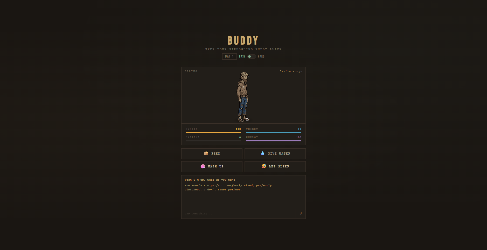
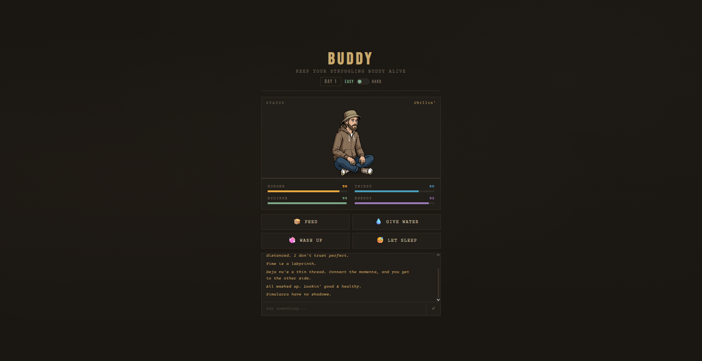

# Buddy
A Tamagotchi-style browser game. Feed, hydrate, wash, and rest Buddy before his stats hit zero.

Buddy used to manage a mid-size hedge fund. Before that he studied philosophy at MIT — wrote his thesis on the ethics of certainty. Somewhere between the markets and the questions he stopped showing up, and eventually stopped having an address. He's not broken. He's just somewhere else now. You keep him alive. You can also talk to him.

---

## The Game

Buddy's hunger, thirst, hygiene, and energy decay in real time. You feed him, give him water, let him sleep, clean him up when he starts to smell. If you neglect him long enough he passes out — game over. Every so often he disappears for a few days to panhandle, comes back dirty and a little quieter. That's just how it goes.

---

## Talking to Buddy

He'll start conversations on his own. He asks questions you don't expect — about the moon, about ancient civilisations, about whether déjà vu is a glitch or a signal. You can ask him anything. He doesn't always answer fully. That's the point. Every run starts fresh; he won't remember the last time you let him die.

---

## Screenshots


*A good day. Stats are high. He's in the mood to talk.*


*Hygiene dropped below 15. He switched to his dirty sprites automatically and got quieter.*


*"Simulacra have no shadows." — unprompted, mid-afternoon.*

---

## Getting Started

You'll need to serve it locally — just opening the HTML file directly won't work because of how the modules load.

**Option 1 — VSCode Live Server (easiest)**
Install the [Live Server](https://marketplace.visualstudio.com/items?itemName=ritwickdey.LiveServer) extension, right-click `index.html`, and hit **Open with Live Server**.

**Option 2 — Node**
```bash
npx serve .
```

**Option 3 — Python**
```bash
python3 -m http.server 5500
```

Then open `http://localhost:5500`.

---

## Setting Up the AI

Buddy needs an API key to talk. Create a file at `js/config.js` — it's in `.gitignore` so it'll never be committed.

```js
window.BUDDY_CONFIG = {
  provider: "groq",        // see options below
  apiKey:   "your-key-here",
  model:    "",            // leave blank to use the provider default
};
```

Supported providers:

| Provider | Model default | Notes |
|---|---|---|
| `"anthropic"` | `claude-haiku-4-5` | Best character rendering |
| `"groq"` | `llama-3.1-8b-instant` | Free, fast, good enough |
| `"gemini"` | `gemini-1.5-flash` | Generous free tier |
| `"openai"` | `gpt-4o-mini` | Reliable fallback |
| `"deepseek"` | `deepseek-chat` | Very cheap, China servers |
| `"kimi"` | `moonshot-v1-8k` | Good context window, China servers |

For development, Groq is free and works well. For the best version of the character, use Anthropic Haiku (Needs credits available on your Anthropic account).

---

## Building On It

Three things worth knowing if you want to change how Buddy feels:

- **His personality** — `js/chat.js`, the `buildSystemPrompt()` function. All the flavour text describing his mental state lives there.
- **How fast stats decay** — `js/game.js`, the `DECAY` object. Easy and hard mode rates are both there.
- **What he says to open a conversation** — `js/chat.js`, the `STARTERS` array at the top.

---

## Project Structure

```
buddy/
├── index.html          # The whole UI — game, stats, chat panel
├── css/
│   └── style.css       # All visual styling; colours defined as CSS variables at the top
├── js/
│   ├── main.js         # Starts everything up, owns the game loop and chat wiring
│   ├── game.js         # The actual game rules — stat decay, actions, what kills you
│   ├── ui.js           # Anything that touches the DOM — rendering, bars, chat messages
│   ├── sprites.js      # Knows which sprite sheet to show and when to advance frames
│   ├── chat.js         # Buddy's personality, system prompt, conversation history
│   ├── llm.js          # Talks to whichever AI provider you've configured; nothing else does
│   └── config.js       # Your API key and provider choice — gitignored, never committed
├── sprites/            # Pixel art spritesheets, one per animation × clean/dirty state
└── screenshots/        # Screenshots for this README
```
